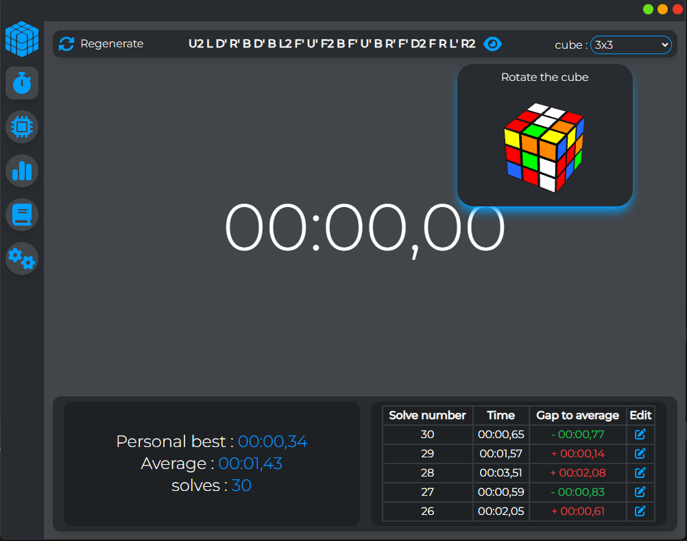
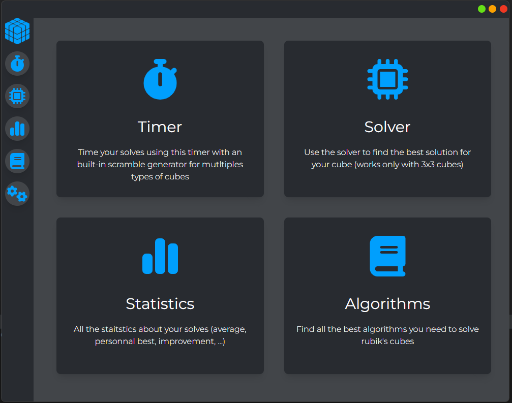

<div align="center">

# Cuby

---


</div>

**Cuby** a ElectronJS app for *Rubik's Cubes*, it contains everything you need to solve, time, learn and explore Rubik's Cubes.  I created this app using electronJS, it's still in development for now but can already use it, read the installation tutorial if you want to give it a try.

<div align="center">
-<a href="https://github.com/quentinformatique/Cuby/issues/new/choose">Report a bug</a>--<a href="https://github.com/quentinformatique/Cuby/issues/new/choose">Request a feature</a>-
</div>

## Features

---
- Timer
- Scramble generator
- Statistics
- Multiples cubes
- algorithms library (in development)
- auto solve (in development)
## Screenshots

---


## Installation

---
if you want to try the app you can either download the release or follow these steps:
1. Clone or fork this repositorie
2. run the following commands at the root folder:
    - ```npm install```
    - ```npx tailwindcss -i ./src/css/input.css -o ./src/css/tailwind/output.css --watch```
    - ```npm run start```

## Contributing

---
Contributions are what make the open source community such an amazing place to learn, inspire, and create. Any contributions you make are **greatly appreciated**.

If you have a suggestion that would make this better, please fork the repo and create a pull request. You can also simply open an issue with the tag "enhancement".
Don't forget to give the project a star! Thanks again!

1. Fork the Project
2. Create your Feature Branch (`git checkout -b feature/AmazingFeature`)
3. Commit your Changes (`git commit -m 'Add some AmazingFeature'`)
4. Push to the Branch (`git push origin feature/AmazingFeature`)
5. Open a Pull Request

## Coming in the future

---
This app is still in development, I'm currently working on the statistics sections, I want a page where you can find all the information about your solves with charts. I have just finished the inner modelisation, so now the app is usable, but there is still a lot of progress too, if you have any suggestions fell free to open a pull request or an issue if you find a bug.

## Version: v2.0
## Developed by : *quentinformatique*

