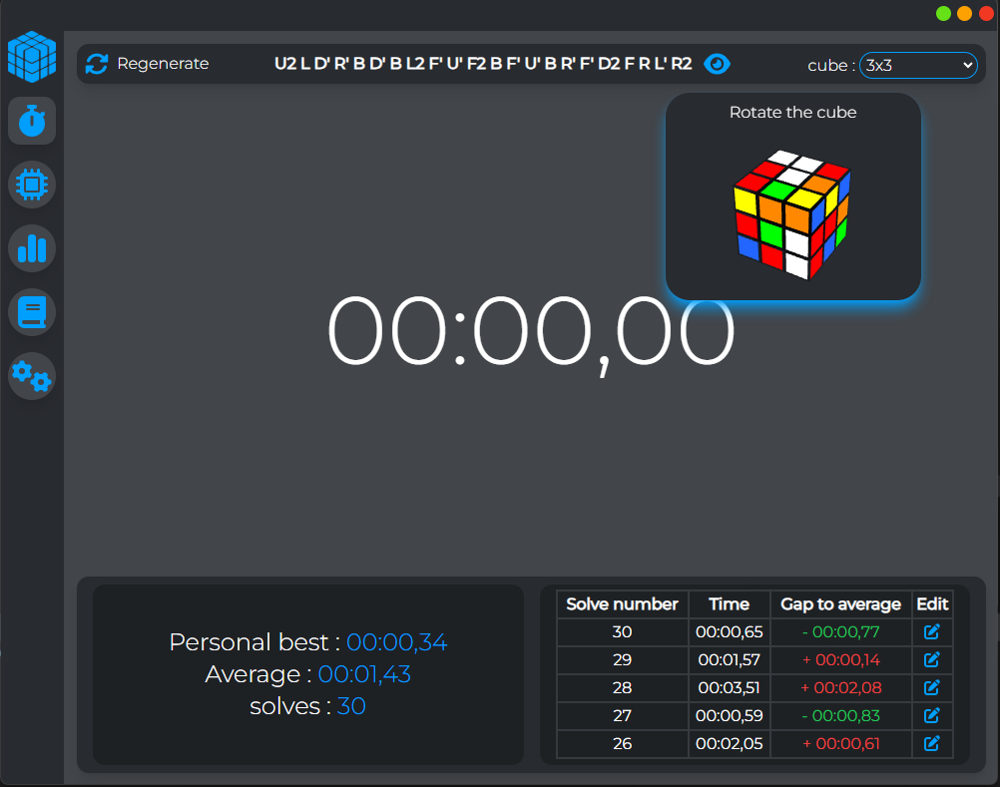
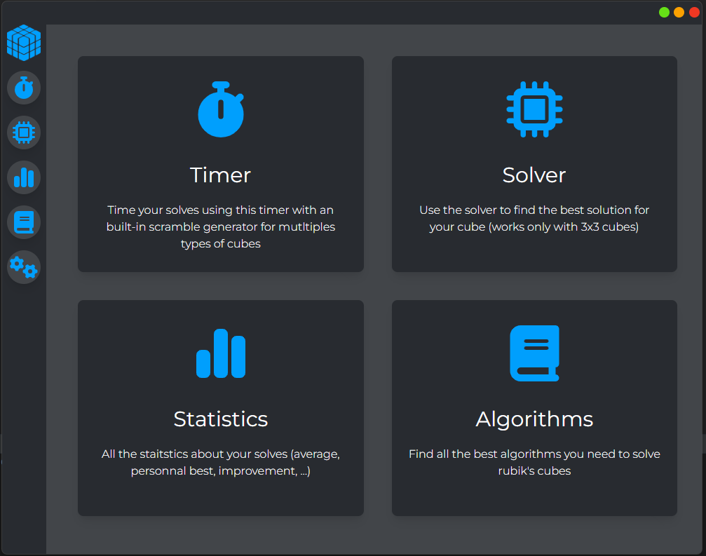
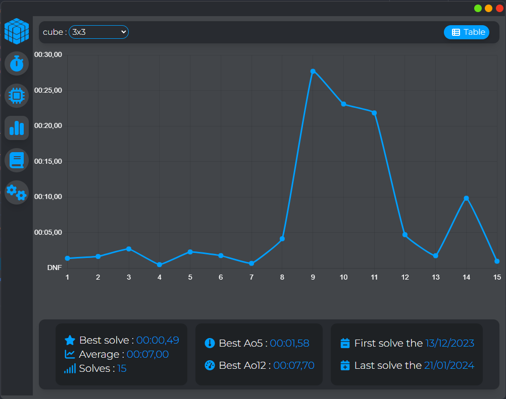

# 🧊 Cuby

<div align="center">

[](https://github.com/quentinformatique/Cuby/stargazers)
[](https://github.com/quentinformatique/Cuby/network)
[](https://github.com/quentinformatique/Cuby/issues)
[](https://github.com/quentinformatique/Cuby/commits/main)

</div>

## 📝 Description

Cuby is a comprehensive ElectronJS application for Rubik's Cube enthusiasts. It provides everything you need to solve, time, learn, and explore Rubik's Cubes. Built with ElectronJS, this application is currently in active development but already offers a range of useful features.

## 🔗 Related Projects

- [Cuby Mobile App](https://github.com/Cuby-Project/Cuby-mobile-app) - Mobile version of Cuby
- [Cuby Recognition API](https://github.com/Cuby-Project/Cuby-recognition-API) - Color detection API
- [Cuby Solve API](https://github.com/Cuby-Project/Cuby-solve-API) - Cube solving algorithm API
- [Cuby Capture API](https://github.com/Cuby-Project/Cuby-capture-API) - Cube state capture API
- [Cuby Capture Website](https://github.com/Cuby-Project/Cuby-capture-website) - Web interface for cube capture

## ✨ Features

- ⏱️ Timer with statistics
- 🔄 Scramble generator
- 📊 Detailed statistics and analytics
- 🎯 Multiple cube support
- 📚 Algorithm library (in development)
- 🤖 Auto-solve feature (in development)

## 🖼️ Screenshots





## 🚀 Installation

### Option 1: Download Release

Download the latest release from the [releases page](https://github.com/quentinformatique/Cuby/releases).

### Option 2: Build from Source

1. Clone the repository:

```bash
git clone https://github.com/quentinformatique/Cuby.git
```

2. Install dependencies:

```bash
npm install
```

3. Start the development server:

```bash
npm run start
```

4. For development with Tailwind CSS:

```bash
npx tailwindcss -i ./src/css/input.css -o ./src/css/tailwind/output.css --watch
```

## 🤝 Contributing

Contributions are what make the open source community such an amazing place to learn, inspire, and create. Any contributions you make are **greatly appreciated**.

1. Fork the Project
2. Create your Feature Branch (`git checkout -b feature/AmazingFeature`)
3. Commit your Changes (`git commit -m 'Add some AmazingFeature'`)
4. Push to the Branch (`git push origin feature/AmazingFeature`)
5. Open a Pull Request

## 📄 License

This project is licensed under the MIT License - see the [LICENSE](LICENSE) file for details.

## 📞 Support

- [Report a bug](https://github.com/quentinformatique/Cuby/issues/new/choose)
- [Request a feature](https://github.com/quentinformatique/Cuby/issues/new/choose)
